# taskforge

**Grid-warehouse environments where solvability is a proof, not a hope — and the proof is worth more than the task.**

Synthetic agent data is only useful if it is verified. `taskforge` generates warehouse fulfillment tasks and refuses to emit one until an A\* oracle has produced an optimal plan for it and that plan has been replayed through the real executor. The same search that certifies a task also yields its reward function, its difficulty label, its curriculum slot, and its ground-truth grader — so the certificate is reused five times downstream rather than thrown away.

<p align="center">
  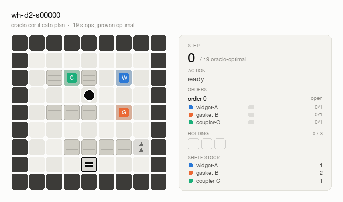
</p>

<p align="center"><em>The oracle's certificate plan executing. The side panel tracks per-SKU order fill, what the robot is carrying, and <code>step N / oracle-optimal 40</code> — the denominator is a proof, not an estimate.</em></p>

---

## The signature image

<p align="center">
  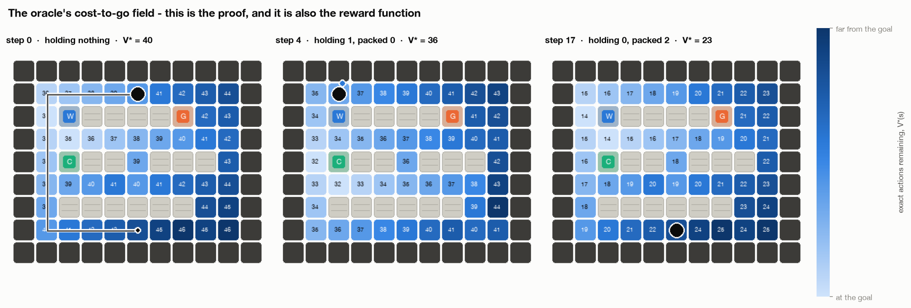
</p>

**This is the proof, and it is also the reward function.** Each cell shows V\*(s) — the exact number of actions still required to finish the job, from that cell, in that symbolic state. It is not a distance transform: the field is defined over full states, so picking an item or packing a box redraws it (V\* = 40 → 36 → 23 across the three panels). The verifier computes this table to prove the task is solvable. Negating it gives Φ(s) = −V\*(s), a potential-based shaping term that is policy-invariant by Ng, Harada & Russell (1999). One search, two products.

---

## Quickstart

```bash
git clone https://github.com/BrandanBurgess/taskforge && cd taskforge
python -m venv .venv && source .venv/bin/activate
pip install -e ".[dev,rl]" sb3-contrib
python demo.py
```

**No API key is needed.** Not for the demo, not for any headline number in this README, not for CI. Everything runs offline from the procedural generator plus 60 committed pre-verified specs. The LLM paths (task generation and the LLM agent) are optional enhancements that degrade cleanly when `ANTHROPIC_API_KEY` is absent.

`demo.py` takes ~2 minutes on an M1: generate → verify through V1/V2/V3 → print the certificate plan → render the hero GIF and cost-to-go field → short PPO run → evaluate every agent → write figures → summary table.

There is also an [interactive HTML replay viewer](docs/replay.html) (self-contained, no CDN) — open it from disk and scrub through a certified plan step by step.

---

## How verification works

A task is accepted only if **all three** stages pass. There is no "accept on unknown".

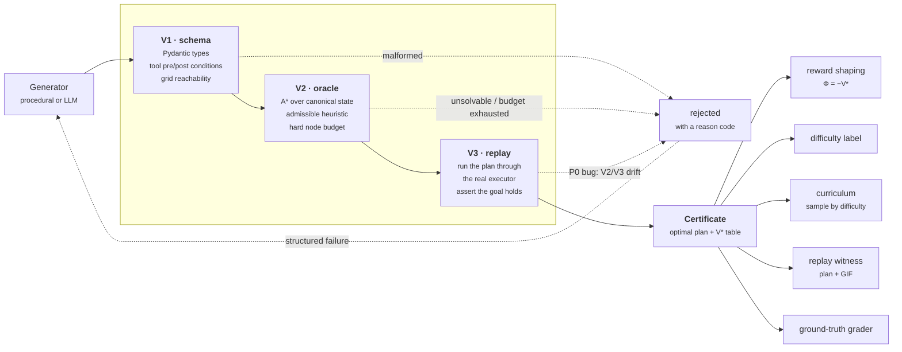

**V1 — schema and well-formedness.** Pydantic validation, plus checks the type system cannot express: every declared tool precondition names a predicate the world actually implements; every SKU has exactly one shelf cell with a walkable neighbour; stock covers what the orders require; every locked zone has a keycard that is reachable and not itself orderable; no conveyor points into a wall.

Fifteen distinct rejection codes, each of which becomes a repair instruction for the LLM generator rather than a bare "invalid":

`bad_keycard` · `conveyor_trap` · `duplicate_tool` · `empty_goal` · `key_behind_own_lock` · `missing_shelf` · `no_tools` · `orderable_keycard` · `pack_locked` · `start_blocked` · `start_locked` · `unknown_goal` · `unknown_predicate` · `unreachable_shelf` · `zone_without_key`

**V2 — the solvability oracle.** A\* over the canonical symbolic state to the goal predicate, with a domain heuristic and an explicit node budget (200,000 by default). **Conservative rejection**: budget exhausted means *rejected*, never accepted-on-unknown. When budgets started biting we shrank the worlds rather than raising the ceiling — a picky verifier is fine, a slow one is not.

**V3 — execution replay.** The certificate is run back through the executor step by step, asserting each precondition and the goal predicate at the end. This looks redundant, because V2's successor function is built from the same executor. That is exactly why it is there: the classic silent bug in a setup like this is an oracle that searches a subtly different world than the one the agent acts in, and a V2/V3 disagreement is the only place that shows up. Any disagreement is a **P0 bug, not a rejected task**, and the pipeline counts it separately so it can never be mistaken for one.

### What "provably solvable" does and does not mean

It means: **there exists a plan, in this executor, reaching this goal predicate, within this step budget — and here it is.** The claim is constructive and machine-checked twice.

It does **not** mean the task is solvable in the real world, or under different physics, or that a plan exists beyond the node budget. Budget exhaustion is reported as `budget_exhausted`, which is an admission of ignorance, not a verdict. `unsolvable` is stronger — it means the search space drained inside the step budget with no goal found — but it is still relative to *that budget*. Both are rejections; only one is a proof of impossibility.

---

## Results

Every number below traces to a committed `results/*.json` produced by a run that was actually executed on an 8 GB M1 (CPU only). Reproduction commands are given per section.

### Verification funnel

<p align="center">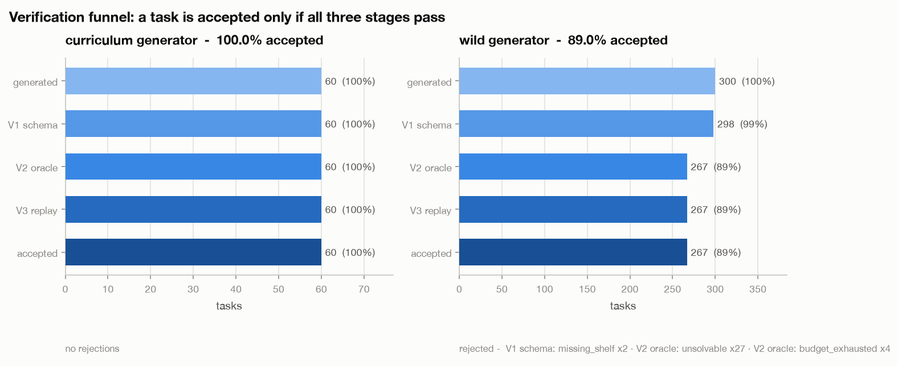</p>

```bash
python scripts/build_specs.py --curriculum 12 --wild 300     # results/verification_funnel.json
```

| arm | attempts | V1 pass | V2 pass | accepted | rate |
|---|---|---|---|---|---|
| curriculum (tuned ladder) | 60 | 60 | 60 | **60** | 100.0% |
| wild (randomized knobs) | 300 | 298 | 267 | **267** | 89.0% |

Rejection reasons — wild arm: `V1 missing_shelf` ×2, `V2 unsolvable` ×27, `V2 budget_exhausted` ×4.

The two arms exist because a funnel where nothing is ever rejected measures nothing. The curriculum is tuned to be safe and owns the headline results; the wild arm samples knobs freely — including batteries too small to finish the job, step budgets below the optimum, and conveyor layouts that strand the robot — so each rejection path is actually exercised.

### V2/V3 agreement

**100.00%** across all 327 certified plans (60 curriculum + 267 wild), plus 418 mutation-engine acceptances. Zero disagreements. This is the number I would want a reviewer to check first, and `scripts/check_specs.py` re-runs it against every committed spec in CI.

### Oracle behaviour across the difficulty ladder

```bash
python scripts/build_specs.py --curriculum 10 --wild 0
```

| difficulty | grid | orders | features | accepted | optimal plan | peak nodes expanded |
|---|---|---|---|---|---|---|
| 1 | 7×7 | 1 | — | 10/10 | 7–13 | 27 |
| 2 | 9×9 | 1 | conveyor | 10/10 | 16–23 | 83 |
| 3 | 11×9 | 2 | conveyors | 10/10 | 33–54 | 1,108 |
| 4 | 13×11 | 2 | + zone, battery | 10/10 | 48–69 | 20,984 |
| 5 | 13×11 | 3 | + 2 zones | 10/10 | 83–103 | 47,713 |

50/50 accepted in 7.9 s total (measured on the M1 with the training run competing for CPU).

### Agent evaluation, graded by the oracle

<p align="center">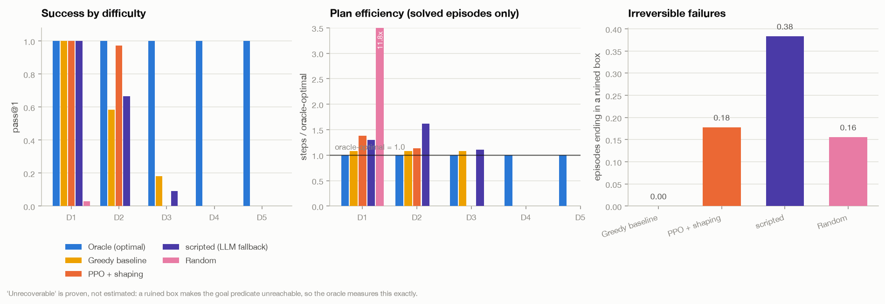</p>

```bash
python evaluate.py --buckets 1,2,3,4,5 --episodes 3        # results/agent_eval.json
```

| agent | pass@1 | steps / oracle-optimal | invalid actions | ended in an unrecoverable state |
|---|---|---|---|---|
| oracle (replays its certificate) | 1.000 | 1.00× | 0.0% | 0.0% |
| greedy baseline | 0.333 | 1.08× | 6.1% | **0.0%** |
| scripted agent *(LLM fallback, no key)* | 0.333 | 1.42× | 11.0% | **38.3%** |
| random (uniform over **legal** actions) | 0.006 | 11.75× | 20.8% | 15.6% |

pass@1 by difficulty bucket:

| agent | D1 | D2 | D3 | D4 | D5 |
|---|---|---|---|---|---|
| greedy | 1.00 | 0.58 | 0.18 | 0.00 | 0.00 |
| scripted | 1.00 | 0.67 | 0.09 | 0.00 | 0.00 |
| random | 0.03 | 0.00 | 0.00 | 0.00 | 0.00 |

The oracle row is a **sanity check, not a result** — it must be exactly 1.000 at ratio 1.00×, and `evaluate.py` asserts it. If it ever drops, the executor and the certificates have drifted and every other row is suspect.

The random baseline samples uniformly from *legal* actions, not from all 25. A random baseline that mostly emits illegal actions is a straw man that flatters everything above it.

#### Same task, three agents, side by side

<p align="center">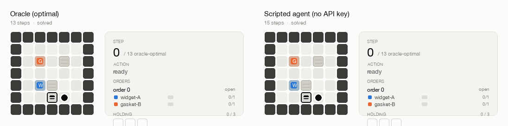</p>

The oracle's certificate, the trained PPO policy, and the LLM-slot agent on the *same* task, with their step counters running underneath. All three are graded by the same goal predicate; the leftmost pane is the denominator the other two are measured against.

```bash
python scripts/make_visuals.py --model checkpoints/ppo_shaped.zip
```

### The irreversibility study

This is the result a normal gridworld cannot give you. Packing a SKU an order does not need permanently ruins the box, and because the goal requires every order dispatched, a ruined box makes the goal **provably** unreachable. "Unrecoverable" is therefore not a heuristic judgement — it is a property the oracle decides exactly.

- **Greedy: 0.0%.** It explicitly checks that its cargo fits the order before packing, and sheds cargo that does not. It is *designed* not to make this mistake.
- **Scripted (greedy + 12% random action): 38.3%.** A small amount of sloppiness is enough to destroy a box in more than a third of episodes.
- **Random: 15.6%.** Lower than the scripted agent only because it rarely accumulates useful cargo or reaches the packing station in the first place.

The gap between 0.0% and 38.3% is the whole point: the difference between those two agents is 12% noise, and the cost of that noise is measurable to the episode because the oracle can decide deadness.

### Difficulty calibration

<p align="center">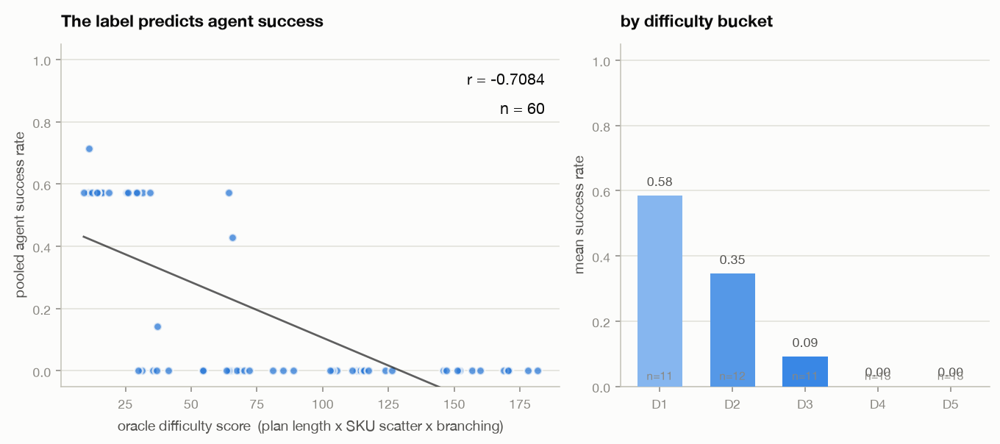</p>

The label is `plan length × SKU scatter × branching factor`, bucketed into 1–5 on frozen thresholds. Correlated against pooled agent success across 60 tasks:

**r = −0.708** (negative is the expected direction — harder tasks, fewer solves), and mean success falls monotonically across buckets:

| bucket | D1 | D2 | D3 | D4 | D5 |
|---|---|---|---|---|---|
| mean agent success | 0.584 | 0.345 | 0.091 | 0.000 | 0.000 |

The label is derived entirely from the oracle's search statistics — no agent was run to produce it — and it still predicts agent success. That is the claim worth making.

### RL learnability

<p align="center">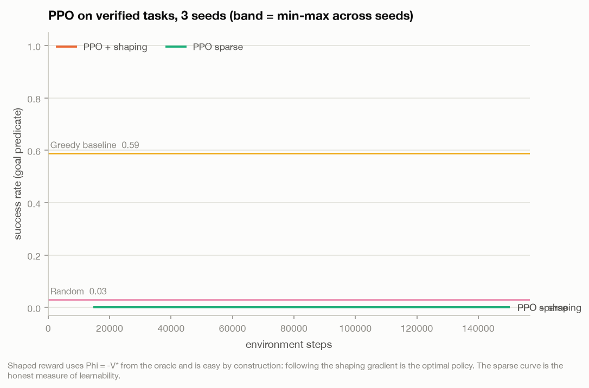</p>

```bash
python train.py --steps 600000 --seeds 3 --reward both \
  --train-buckets 1,2 --eval-buckets 1,2 --holdout-buckets 3,4   # results/rl_training.json
```

<!--RL_TABLE-->

**The shaped result is easy by construction and is not the headline.** Φ = −V\* is the exact optimal cost-to-go, so following the shaping gradient *is* the optimal policy. It demonstrates that the oracle → potential → learner plumbing works end to end. It does not demonstrate that the task is hard. The sparse number is the honest measure.

### Generalization to unseen difficulty

<p align="center">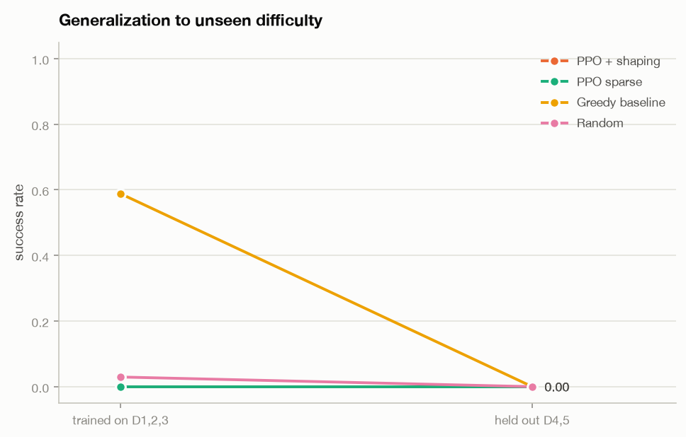</p>

Train on the easy buckets, evaluate on harder held-out ones. The drop is reported honestly; a failure to generalize is a finding, not an embarrassment.

### Diversity — MAP-Elites over compounding edits

<p align="center">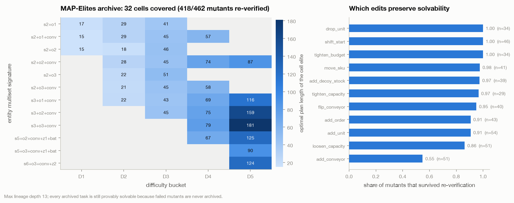</p>

```bash
python harness/mutate.py --iterations 500        # results/map_elites.json
```

- **32 archive cells** covered over (difficulty × entity multiset), spanning 12 distinct entity signatures from `s2+o1` to `s6+o3+conv+z2`.
- **418 / 462 mutants (90.5%) survived re-verification.** Every mutant goes back through the full V1/V2/V3 pipeline, so the archive can only ever contain provably-solvable tasks no matter how many generations of edits produced them.
- **Max lineage depth 13**, mean 6.25 — edits genuinely compound rather than staying one hop from a seed.
- Rejections by stage: 24 at V1, 20 at V2.

The most interesting row is the per-operator survival rate: **`add_conveyor` survives only 55%**, by far the lowest, because a one-way conveyor is the single easiest way to make a warehouse unsolvable. `drop_unit`, `shift_start` and `tighten_budget` survive 100%. That ranking is a free by-product of re-verifying every mutant, and it is the kind of thing you cannot know without an oracle.

---

## Oracle reuse — the intellectual core

The argument of this project is that the expensive part of generating a verified task is the search, and the search's output is worth far more than the accept/reject bit it was run for. Four reuses, each with a result above:

| reuse | what it is | where it lands |
|---|---|---|
| **Reward shaping** | Φ(s) = −V\*(s) from the exact cost-to-go table | learning curves |
| **Difficulty label** | plan length × SKU scatter × branching, calibrated | r = −0.708 |
| **Curriculum** | tasks sampled by difficulty bucket; train easy, hold out hard | the generalization result |
| **Replay witness** | every accepted task ships its certificate plan + GIF | `specs/*.json`, hero GIF, HTML replay |
| **Ground-truth grader** | every agent scored by the same goal predicate | the eval table |

A further one fell out during the build: the certificate length also sets a sensible **training episode horizon**. A task with an 8-step optimum was burning 120-step episodes, so a fixed sample budget bought 15× fewer episodes than it should have. Truncating training episodes at 3× the certificate length fixed it. Evaluation always uses the full certified step budget, so no agent is judged on a horizon the task was not certified against.

### Why potential-based shaping is safe, precisely

Adding F(s,s′) = γΦ(s′) − Φ(s) to a reward leaves the optimal policy unchanged for **any** potential function Φ (Ng, Harada & Russell, 1999). Using −V\* is not what makes it *sound* — it is what makes it *maximally informative*. When a task's state space is too large to enumerate exactly, `taskforge` falls back to Φ = −h(s) with the admissible heuristic: weaker, equally sound.

---

## The domain

A discrete 2D grid warehouse. No physics engine — everything is symbolic and finite, which is what makes the oracle exact.

<p align="center">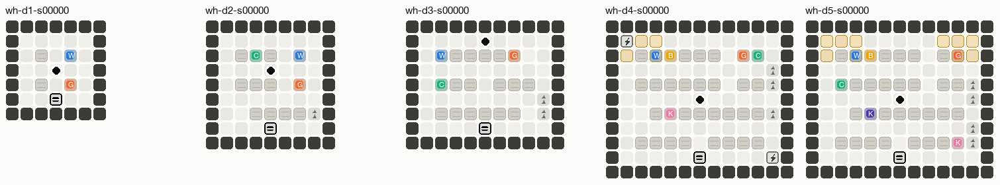</p>

<p align="center"><em>One task from each rung of the difficulty ladder. Amber cells are badge-locked zones, chevrons are one-way conveyors, coloured chips are SKU shelves, and the black disc is the robot.</em></p>

- **World**: walls, racking, shelf cells (one per SKU), aisles, one-way conveyor cells, one packing station, badge-locked zones, charge docks.
- **Agent**: a picker robot with a position, a held multiset under a capacity limit, and an optional battery.
- **Actions**: `move{N,S,E,W}`, `pick(sku)`, `place(sku)`, `pack(order_id)`, `scan(order_id)`, `charge`, `unlock(zone)`.
- **Goal**: every order filled with exactly its required SKUs and dispatched via `scan`.
- **Irreversibility**: `pack(order_id)` deposits the robot's **entire held multiset** into that order. Any surplus or unwanted SKU ruins the box permanently.

### Three modelling decisions that make the oracle exact and tractable

1. **One shelf cell per SKU**, so shelf stock is a *derived* quantity — `stock[s] = available − held − packed − keys spent` — and never enters the state hash. Large state-space win for no loss of fidelity.
2. **A ruined box is a proven dead end.** The goal requires every order dispatched, so a nonzero ruined mask makes the goal unreachable. Dead states get no successors at all, which is what makes irreversibility cheap to reason about instead of expensive.
3. **Battery is hashed exactly, never bucketed.** Bucketing is cheaper but unsound: two states with different charge are genuinely different, and collapsing them can let the oracle certify a plan the executor cannot run. Soundness wins; when a world got too big we shrank it.

---

## Architecture

The verifier core is **domain-agnostic** and never imports a world package. It talks to domains only through a small `WorldPack` protocol — initial state, successors, goal test, dead test, admissible heuristic — and a `TaskSpec` is an envelope carrying generic fields plus an opaque `payload` that the named world validates into its own typed model. Adding a second domain means implementing that protocol; it means changing nothing in `taskforge/verify/`.

| path | what lives there |
|---|---|
| `taskforge/dsl.py` | typed DSL (Pydantic v2) + the `WorldPack` protocol and registry |
| `taskforge/verify/` | domain-agnostic V1 / V2 / V3, oracle, cost-to-go, difficulty labelling |
| `taskforge/worlds/warehouse/` | the warehouse world pack: spec, executor, heuristic, generator |
| `taskforge/envs/` | Gymnasium env — structured-vector and pixel observations, action masking |
| `taskforge/generators/llm.py` | LLM generator: forced tool use → DSL JSON, structured repair loop |
| `harness/render.py` | headless pygame-ce renderer, GIF/PNG export |
| `harness/palette.py` | one palette shared by the renderer and every figure, light + dark |
| `harness/figures.py`, `visuals.py` | every README figure, drawn from committed results JSON |
| `harness/mutate.py` | MAP-Elites over compounding edits, each mutant re-verified |
| `harness/agents.py` | oracle / greedy / random / scripted / LLM / PPO, one interface |
| `specs/` | 60 committed pre-verified tasks (spec + certificate + difficulty) |
| `results/` | every number in this README, with its seed |
| `docs/img/`, `docs/replay.html` | figures and the self-contained replay viewer |

### The LLM generation path

Claude emits **DSL JSON via forced tool use — never free-form code**, so the worst a bad generation can do is fail validation. Rejections feed back verbatim (`V1 missing_shelf: SKU 2 has no shelf cell`), which is actionable in a way that "invalid task" is not, for up to N repair rounds.

> **LLM generation path is implemented and unit-tested against a mocked client; not benchmarked at scale (no key available).**

The eight tests in `tests/test_llm_generator.py` pin down the parts that are actually ours: that a malformed payload becomes a clean V1 rejection instead of a traceback, that a structurally-valid-but-unsolvable task falls through to V2 (which is why there is more than one stage), that the repair prompt carries the verifier's failure back to the model, and that the loop gives up after the limit.

---

## Honest caveats

Read this section before quoting any number above.

- **The shaped-reward result is easy by construction.** Φ is the exact optimal cost-to-go, so the shaping gradient *is* the optimal policy. It proves the plumbing, not the difficulty. The sparse number is the real one.
- **The state space is symbolic and small.** Grids are ≤ 16×16, ≤ 6 SKUs, ≤ 3 orders. This is a planning domain, not a robotics simulator, and none of it says anything about continuous control.
- **"Solvable" is bounded by the oracle's budget.** 200,000 expanded nodes and the spec's step budget. `budget_exhausted` means *we don't know*, and we reject on it.
- **Optimality is cross-checked exhaustively only up to difficulty bucket 3.** Below that, every certificate's length is confirmed against uninformed BFS and against a full backward-Bellman V\* enumeration. Above it the state space is too large to enumerate, so optimality rests on the admissibility argument plus A\* with reopening — sound reasoning, but not an independent check. Solvability itself is still machine-verified at every difficulty, because V3 replays the plan; it is the *minimality* of the plan that is argued rather than exhaustively confirmed at buckets 4–5.
- **LLM-generator statistics do not exist.** No API key was available. The path is implemented and unit-tested against a mock; it has never been run at scale.
- **The "LLM agent" row in the eval table is a scripted fallback** (greedy + 12% random actions) and is labelled as such everywhere, including in `results/agent_eval.json` via `used_llm: false`. It exercises the harness offline; it is not a measurement of any language model.
- **Difficulty calibration pools four agents over 60 tasks.** r = −0.708 is a real correlation on a small, self-generated corpus, not a validated psychometric instrument.
- **Single machine, single hardware profile.** All timings are 8 GB M1, CPU only.

---

## Design decisions worth logging

- **Difficulty 5 has no battery.** Battery multiplies the canonical state space by the charge range and cannot be bucketed soundly. Measured: a 13×11 / 3-order world certifies 4/6 seeds in 15 s with battery, 6/6 in 1.5 s without. Rather than raise the node budget, battery lives at difficulty 4 where the world is small enough to absorb it, and difficulty 5 buys hardness from more orders, tighter routing and two gated zones.
- **A\* runs with reopening and no closed set.** The heuristic is the max of two independent lower bounds (a Held-Karp tour through the outstanding SKUs, and a per-order round-trip argument), which makes it admissible but **not consistent**. Closed-set A\* is only optimal for consistent heuristics — run on an inconsistent one it silently returns plans a few steps too long. It did: the oracle reported 42 on a task whose true optimum is 40, with no test failing and no admissibility violation anywhere. `tests/test_oracle.py::test_astar_matches_exact_vstar` now pins the cost against a full backward-Bellman enumeration.
- **The shaping discount is 1.0, not γ.** At γ = 0.99 a step that makes no progress still pays (1−γ)·V\(s\) > 0, growing with distance from the goal. PPO found it and learned to run out the full 120-step budget rather than finish in 8. At 1.0 the shaping telescopes exactly and the exploit disappears; for an episodic task with Φ(terminal) = 0 the invariance argument still holds.
- **Agents are evaluated stochastically, not by argmax.** A deterministic policy in a gridworld with cycles gets absorbed by them — a policy averaging ~12 return in training scored −1.24 under argmax because it packed a partial order and then oscillated N/S until the budget ran out.
- **Action masking is applied during training, not only at inference.** Masking at inference only is a train/test mismatch that makes the reported invalid-action rate describe the wrapper rather than the policy.
- **Infrastructure is shape-coded, SKUs are hue-coded.** In the renderer the categorical palette slots belong to SKU identity; the packing station, docks and conveyors are drawn in neutral ink with distinct shapes. Colouring the charge dock "aqua" made it indistinguishable from whichever SKU held that slot.

---

## Verifying the code itself

```bash
pytest -q                     # 110 tests
ruff check .
python scripts/check_specs.py # every committed certificate still replays
python demo.py --smoke        # end to end, no API key
```

What the suite actually pins down:

- **Oracle optimality**, two independent ways: against uninformed BFS on small tasks, and against an exact backward-Bellman V\* enumeration on tasks far too deep for BFS.
- **Admissibility**, checked directly — h(s) ≤ V\*(s) at every enumerated state.
- **Soundness fuzz** — no task the oracle declared `unsolvable` may be solvable by brute force.
- **Per-action precondition/effect correctness**, including that a ruined state accepts *no* action and has *no* successors.
- **Shaping invariance** — the shaping total over a random trajectory telescopes to Φ(end) − Φ(start), independent of route.
- **Gym API conformance** via `gymnasium.utils.env_checker`.
- **Determinism** — same seed ⇒ byte-identical spec, identical oracle plan, byte-identical first frame.
- **Renderer smoke tests** under `SDL_VIDEODRIVER=dummy`.

CI runs install, `ruff`, `pytest`, spec re-verification and `demo.py --smoke` on Python 3.11 and 3.13, **with no API key set** — and asserts one is absent. A green run is the proof that the offline path is real.

---

## Limitations & roadmap

- Only one world pack ships. The `WorldPack` boundary is designed for a second one but is unproven until there is one — a kitchen or a circuit-assembly domain would be the honest test of whether the abstraction holds.
- The oracle is single-agent and fully observable. Partial observability would break the exactness of V\* and force a different verification story.
- Sparse-reward learning is the weakest result here and deserves a proper exploration method (count-based bonuses, or curriculum-by-difficulty using the label this repo already computes) rather than more steps.
- The LLM generator needs a real benchmark run before its accept rate and repair histogram mean anything.
- MAP-Elites uses plan length as the within-cell fitness. A diversity-aware fitness would probably fill the sparse corners of the archive faster.

## Prior art

This project is an assembly of well-established ideas, not a new one:

- **STRIPS / PDDL classical planning** (Fikes & Nilsson 1971; McDermott et al. 1998) — symbolic states, typed action schemas with preconditions and effects, and goal predicates. The DSL here is a small domain-specific cousin.
- **A\* and admissible heuristics** (Hart, Nilsson & Raphael 1968) — and the consistency-vs-admissibility distinction that cost this repo a real bug.
- **Held–Karp** (1962) — exact TSP-path DP, used here to compute the tour lower bound the heuristic rests on.
- **Potential-based reward shaping** (Ng, Harada & Russell 1999) — the policy-invariance result that makes Φ = −V\* safe to add.
- **MAP-Elites** (Mouret & Clune 2015) — quality-diversity archives over behavioural descriptors.
- **PCG via verification / search-based content generation** (Togelius et al. 2011) — generate-and-test where a solver is the acceptance test.
- **Execution-graded agent evaluation** — grading agents by whether a program state satisfies a predicate, as in SWE-bench-style harnesses (Jimenez et al. 2023) and WebArena (Zhou et al. 2023), rather than by output similarity.

## License

Apache-2.0. See [LICENSE](LICENSE).
